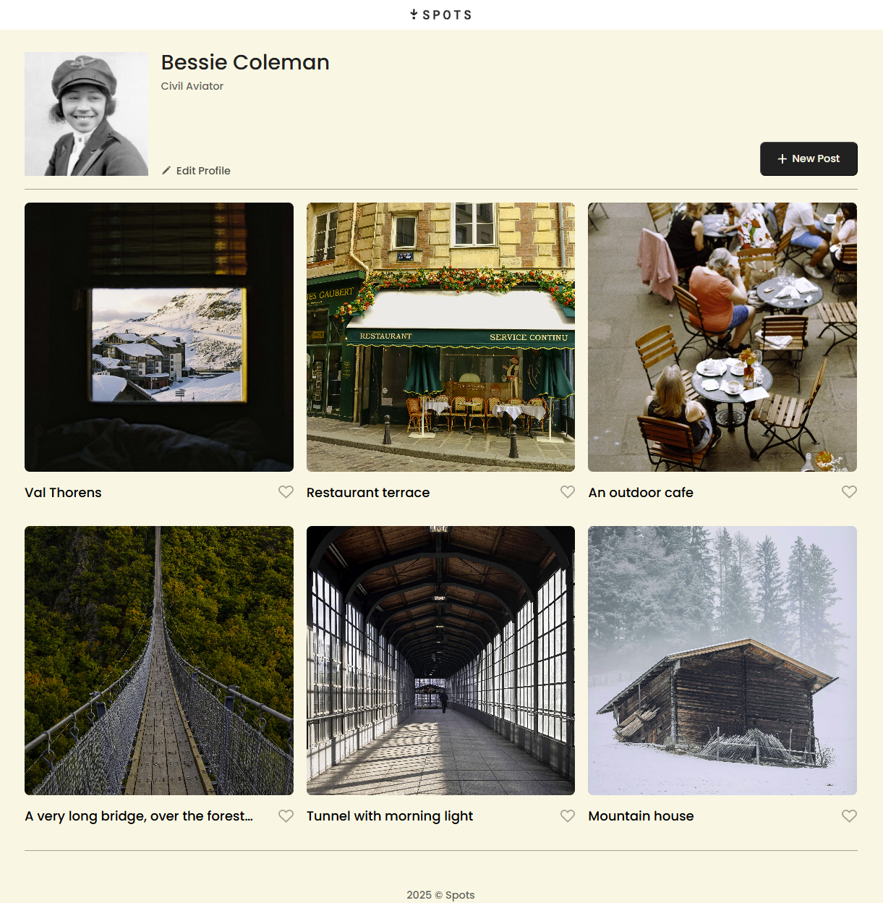
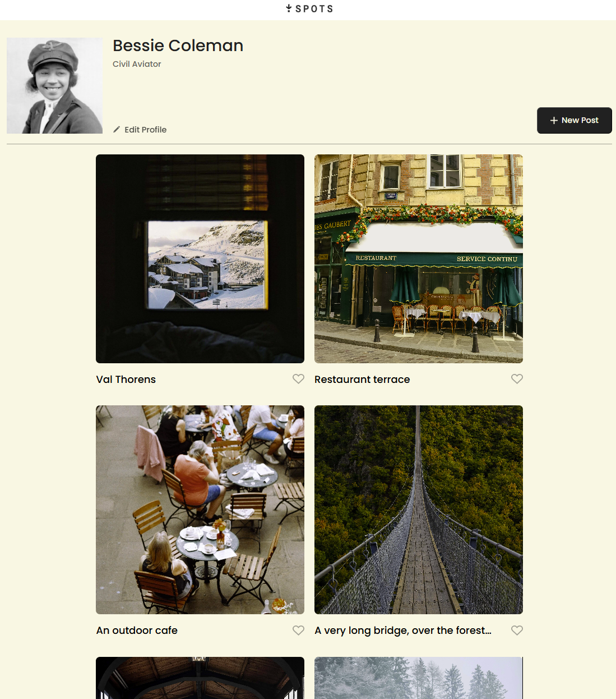
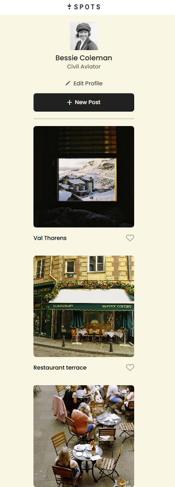

# Project 3: Spots

### Project Description

In this project, I used both grid and flexbox to organize the images and text on the page. I also used media queries to modify the look of the page when used on a mobile device.

<<<<<<< HEAD

=======
  
>>>>>>> 5b997635c96880932b0540e37685e95a07521691
### Website URL

https://trevorjames17.github.io/se_project_spots/
